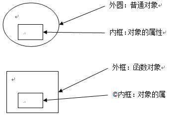

http://github.com/pandoraui/inherit


// 这里推荐参看 john resig 版本去理解

深入了解可参考相关解析，及 《javascript 权威指南》中继承内容

在处理上，各方法大同小异，而随着对 Object.create的支持，以后可以更兼容的处理

通过示例分析及用法展示，更深入的了解使用方式及场景


```js
// 简单的例子（john resig）

var Foo = Class.extend({
  qux: function() {
    return "Foo.qux";
  }
});
var Bar = Foo.extend({
  qux: function() {
    return "Bar.qux, " + this._super();
  }
});

//当 Foo.extends 被执行, 在 qux 方法中由于存在 this._super 所以 Bar原型上的qux 实际上应该是这样的:

Bar.prototype.qux = function () {
  var tmp = this._super;
  this._super = Foo.prototype.qux;
  var ret = (function() {
    return "Bar.qux, " + this._super();
  }).apply(this, arguments);
  this._super = tmp;
  return ret;
}

```

其他示例：

```js
// blade 版本

var Super = _.inherit({
  name: 'xiaohan',
  hello: function(){
    return 'hello ' + this.name;
  }
});

var Sub = _.inherit(Super, {
  name: 'world',
  initialize: function(){
    this.name = 'good'
  },
  hello: function(){
    return 'hello ' + this.name;
  }
});
```

### Prototype、__proto__与Object、Function关系介绍

参看：http://www.blogjava.net/heavensay/archive/2013/10/20/405440.html

- Function、Object：Js自带的函数对象。
- prototype：每一个函数对象都有一个显示的prototype属性，它代表了对象的原型(Function.prototype函数对象是个例外，没有prototype属性)。
- __proto__：每个对象都有一个名为__proto__的内部隐藏属性，指向于它所对应的原型对象(chrome、firefox中名称为__proto__，并且可以被访问到)。

原型链正是基于__proto__才得以形成 (note：不是基于函数对象的属性prototype)。

```js
var o1 = {};              // typeof o1 === "object"
var o2 =new Object();     // typeof o2 === "object"

function f1(){}           // typeof f1 === "function"
var f2 = function(){}     // typeof f2 === "function"
var f3 = new Function('str','console.log(str)'); // typeof f3 === "function"
```

- 通常我们认为o1、o2是对象，即普通对象；f1、f2、f3为函数。
- 但是其实函数也是对象，是由Function构造的，
- f3这种写法就跟对象的创建的写法一样。f1、f2最终也都像f3一样是有Function这个函数构造出来的
- f1、f2、f3为函数对象，Function跟Object本身也是函数对象。

Js中每个对象(null除外)都和另一个对象相关联，通过以下例子跟内存效果图来分析Function、Object、Prototype、__proto__对象间的关系。

```js
function Animal(){  }
var anim = new Animal();

// Animal anim proto
typeof Animal.prototype === "object";
anim.__proto__ === Animal.prototype;              // true
Animal.__proto__ === Function.prototype;          // true
Animal.prototype.__proto__ === Object.prototype   // true

// Function proto
typeof Function.prototype === "function";
typeof Function.__proto__ === "function";
typeof Function.prototype.prototype === "undefined";
typeof Function.prototype.__proto__ === "object";
Function.prototype === Function.__proto__;  //true

// Object proto
typeof Object.prototype === "object";
typeof Object.__proto__ === "function";
typeof Object.prototype.prototype === "undefined";
Object.prototype.__proto__ === null;

// Function Object  proto关系
Function.prototype === Object.__proto__;
Function.__proto__ === Object.__proto__;
Function.prototype.__proto__ === Object.prototype;

// 系统定义的对象Array、Date
var array = new Array();
var date = new Date();

array.__proto__ === Array.prototype;
Array.__proto__ === Function.prototype;
date.__proto__  === Date.prototype;
Date.__proto__  === Function.prototype;
```


上面的内存图跟堆栈结构可以参照文章[Javascript_01_理解内存分配](http://www.cnblogs.com/fool/archive/2010/10/07/1845226.html)。



Function.prototype 函数对象图内部表示 prototype 属性的红色虚框，只是为了说明这个属性不存在。

通过上图Function、Object、Prototype关系图中，可以得出一下几点：

- 所有对象所有对象，包括函数对象的原型链最终都指向了Object.prototype，而Object.prototype.__proto__===null，原型链至此结束。
- Animal.prototype是一个普通对象。
- Object是一个函数对象，也是Function构造的，Object.prototype是一个普通对象。
- Object.prototype.__type__ 指向 null。
- Function.prototype是一个函数对象，前面说函数对象都有一个显示的prototype属性，但是Function.prototype却没有prototype属性，- 即Function.prototype.prototype===undefined，所有Function.prototype函数对象是一个特例，没有prototype属性。
- Object虽是Function构造的一个函数对象，但是Object.prototype没有指向Function.prototype，即Object.prototype!==Function.prototype。

...

http://www.blogjava.net/heavensay/archive/2013/10/20/405440.html


参考：

- [javascript原理介绍](http://www.cnblogs.com/fool/category/264215.html)
- [JavaScript 的原型对象 Prototype](http://www.libuchao.com/2012/05/14/prototypes-in-javascript/)
- [理解js中的原型链，prototype与__proto__的关系](http://rockyuse.iteye.com/blog/1426510)
